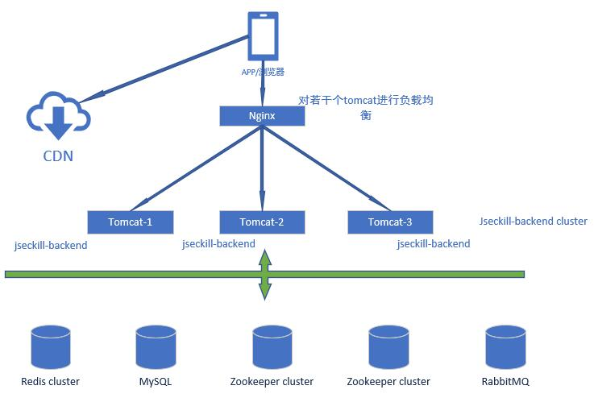

# Spring-Miaosha 高可用秒杀电商

## 0. 概览

### 技术栈

- Spring Boot 2.X
- MyBatis
- Redis, MySQL
- Thymeleaf + Bootstrap
- RabbitMQ
- Zookeeper, Apache Curator

### 架构图

部署图
(zookeeper 暂时没有用上, 忽略之)
<br/><br/>

<br/>
<br/>

### 秒杀过程

秒杀进行的过程包含两步骤：
步骤一（秒杀）：在 Redis 里进行秒杀。 这个步骤用户并发量非常大，抢到后，给与 30 分钟的时间等待用户付款， 如果用户过期未付款，则 Redis 库存加 1
，算用户自动放弃付款。

步骤二（付款）：用户付款成功后，后台把付款记录持久化到 MySQL 中，这个步骤并发量相对小一点，使用数据库的事务解决数据一致性问题

下面重点讲步骤一，**秒杀**过程

秒杀步骤流程图


流程图 Step1：

1.先经过 Nginx 负载均衡;

2.Nginx 里面通过配置文件配置限流功能，限流算法是漏统桶法;

3.Redis 判断是否秒杀过。避免重复秒杀。如果没有秒杀过 <br/>
把用户名（这里是手机号）和 seckillId 封装成一条消息发送到 RabbitMQ，请求变成被顺序串行处理 <br/>
立即返回状态“排队中”到客户端上，客户端上回显示“排队中...”

4.后台监听 RabbitMQ 里消息，每次取一条消息，并解析后，请求 Redis 做库存减 1 操作（decr 命令） <br/>
并手动 ACK 队列
如果减库存成功，则在 Redis 里记录下库存成功的用户手机号 userPhone.

5.流程图 Step2：客户端排队成功后，定时请求后台查询是否秒杀成功，后面会去查询 Redis 是否秒杀成功<br/>
如果抢购成功，或者抢购失败则停止定时查询， 如果是排队中，则继续定时查询。

## 1.总体架构

系统部署图
<br/><br/><br/><br/>

<br/>
<br/>

秒杀进行的过程包含两步骤：
步骤一（秒杀）：在 Redis 里进行秒杀。 这个步骤用户并发量非常大，抢到后，给与 30 分钟的时间等待用户付款， 如果用户过期未付款，则 Redis 库存加 1
，算用户自动放弃付款。

步骤二（付款）：用户付款成功后，后台把付款记录持久化到 MySQL 中，这个步骤并发量相对小一点，使用数据库的事务解决数据一致性问题

秒杀网站的静态资源，比如静态网页引用的 js，css，图片，音频，视频等放到 CDN（内容分发网络）上。<br/>
如果小型互联网公司为了减少成本，可以把静态资源部署到 nginx 下。利用 nginx 提供静态资源服务的高并发性能<br/>
的特点，可以最大可能的提高静态资源的访问速度。
<br/>
通过 nginx 反向代理，对外只暴露 80 端口。同时配置 nginx 的负载均衡，为多个 javamiaosha-backend 集群节点提供<br/>
负载均衡。 负载均衡策略设置成按照几台应用服务器的性能大小的权重分配就行了。

MySQl 部署采用 Master-Slave 主从复制方式来做读写分离, 提高数据库的高并发能力。

## 2.后端暴露秒杀接口

后端暴露接口的作用是：当秒杀时间开始后，才暴露每个商品的 md5，只有拿到 md5 值，才能形成有效的秒杀请求.<br/>
秒杀时间段结束后，此接口不再返回 md5 值. <br/>
暴露秒杀接口数据，属于热点数据，并且值是不变的（库存量除外）, 我们把它存在 Redis 上，Redis 是基于内存的
<br/>
非阻塞性多路复用，采用了 epool 技术，操作数据远远快于磁盘和数据库操作。<br/>
代码见<code>SeckillServiceImpl.java</code>的方法<code>public Exposer exportSeckillUrl(long seckillId)</code>
<br/>
存 Redis 前，先用 Protostuff 框架把对 Seckill 对象序列化成二进制字节码
<br/>

源码<br/>

```java
@Override
    public Exposer exportSeckillUrl(long seckillId) {
        // 优化点:缓存优化:超时的基础上维护一致性
        //1.访问Redis
        Seckill seckill = redisDAO.getSeckill(seckillId);
        if (seckill == null) {
            //2.访问数据库
            seckill = seckillDAO.queryById(seckillId);
            if (seckill == null) {
                return new Exposer(false, seckillId);
            } else {
                //3.存入Redis
                redisDAO.putSeckill(seckill);
            }
        }

        Date startTime = seckill.getStartTime();
        Date endTime = seckill.getEndTime();
        //系统当前时间
        Date nowTime = new Date();
        if (nowTime.getTime() < startTime.getTime()
                || nowTime.getTime() > endTime.getTime()) {
            return new Exposer(false, seckillId, nowTime.getTime(), startTime.getTime(),
                    endTime.getTime());
        }
        //转化特定字符串的过程，不可逆
        String md5 = getMD5(seckillId);
        return new Exposer(true, md5, seckillId);
    }
```

## 3.后端秒杀处理

### 3.1 Java 后端限流

使用 Google guava 的 RateLimiter 来进行限流 <br/>
例如：每秒钟只允许 10 个人进入秒杀步骤. (可能是拦截掉 90%的用户请求，拦截后直接返回"很遗憾，没抢到") <br/>
AccessLimitServiceImpl.java 代码 <br/>

```java
package com.mediaai.javamiaosha.backend.service.impl;

import com.google.common.util.concurrent.RateLimiter;
import com.mediaai.javamiaosha.backend.service.AccessLimitService;
import org.springframework.stereotype.Service;

/**
 * 秒杀前的限流.
 * 使用了Google guava的RateLimiter
 */
@Service
public class AccessLimitServiceImpl implements AccessLimitService {
    /**
     * 每秒钟只发出10个令牌，拿到令牌的请求才可以进入秒杀过程
     */
    private RateLimiter seckillRateLimiter = RateLimiter.create(10);

    /**
     * 尝试获取令牌
     * @return
     */
    @Override
    public boolean tryAcquireSeckill() {
        return seckillRateLimiter.tryAcquire();
    }
}
```

使用限流, SeckillServiceImpl.java

```java
@Override
@Transactional
/**
 * 执行秒杀
 */
public SeckillExecution executeSeckill(long seckillId, long userPhone, String md5) throws SeckillException {
    if (accessLimitService.tryAcquireSeckill()) {   // 如果没有被限流器限制，则执行秒杀处理
        return updateStock(seckillId, userPhone, md5);
    } else {    //如果被限流器限制，直接抛出访问限制的异常
        logger.info("--->ACCESS_LIMITED-->seckillId={},userPhone={}", seckillId, userPhone);
        throw new SeckillException(SeckillStateEnum.ACCESS_LIMIT);
    }
}
```

### 3.2 Redis 执行秒杀

秒杀步骤流程图


1.流程图 Step1：先经过 Nginx 负载均衡和分流

2.进入 javamiaosha 程序处理。 Google guava RateLimiter 限流。 并发量大的时候，直接舍弃掉部分用户的请求

3.Redis 判断是否秒杀过。避免重复秒杀。如果没有秒杀过 <br/>
把用户名（这里是手机号）和 seckillId 封装成一条消息发送到 RabbitMQ，请求变成被顺序串行处理 <br/>
立即返回状态“排队中”到客户端上，客户端上回显示“排队中...”

4.后台监听 RabbitMQ 里消息，每次取一条消息，并解析后，请求 Redis 做库存减 1 操作（decr 命令） <br/>
并手动 ACK 队列
如果减库存成功，则在 Redis 里记录下库存成功的用户手机号 userPhone.

5.流程图 Step2：客户端排队成功后，定时请求后台查询是否秒杀成功，后面会去查询 Redis 是否秒杀成功 <br/>

### 3.3 付款后减库存

源码见<code>SeckillServiceImpl.java</code>
原理是:<br/>
在<code>public SeckillExecution executeSeckill(long seckillId, long userPhone, String md5)</code><br/>
里，先<code>insertSuccessKilled()</code>，<code>再 reduceNumber()</code> <br/>
<b>先插入秒杀记录，再减库存。 这样行锁只作用于减库存一个阶段，提高了操作数据库的并发性能。</b> <br/>
（否则如果先减库存，再插入秒杀记录，则 update 操作产生的行锁会持续整个事务时间阶段，性能差）
<br/>
源码<br/>

```java
@Override
    @Transactional
    /**
     * 先插入秒杀记录再减库存
     */
    public SeckillExecution executeSeckill(long seckillId, long userPhone, String md5)
            throws SeckillException, RepeatKillException, SeckillCloseException {
        if (md5 == null || !md5.equals(getMD5(seckillId))) {
            logger.info("seckill data rewrite!!!. seckillId={},userPhone={}", seckillId, userPhone);
            throw new SeckillException("seckill data rewrite");
        }
        //执行秒杀逻辑:减库存 + 记录购买行为
        Date nowTime = new Date();

        try {
            //插入秒杀记录(记录购买行为)
            int insertCount = successKilledDAO.insertSuccessKilled(seckillId, userPhone);
            //唯一:seckillId,userPhone
            if (insertCount <= 0) {
                //重复秒杀
                logger.info("seckill repeated. seckillId={},userPhone={}", seckillId, userPhone);
                throw new RepeatKillException("seckill repeated");
            } else {
                //减库存,热点商品竞争
                // reduceNumber是update操作，开启作用在表seckill上的行锁
                int updateCount = seckillDAO.reduceNumber(seckillId, nowTime);
                if (updateCount <= 0) {
                    //没有更新到记录，秒杀结束,rollback
                    throw new SeckillCloseException("seckill is closed");
                } else {
                    //秒杀成功 commit
                    SuccessKilled payOrder = successKilledDAO.queryByIdWithSeckill(seckillId, userPhone);
                    logger.info("seckill SUCCESS->>>. seckillId={},userPhone={}", seckillId, userPhone);
                    //事务结束，关闭作用在表seckill上的行锁
                    return new SeckillExecution(seckillId, SeckillStateEnum.SUCCESS, payOrder);
                }
            }
        } catch (SeckillCloseException e1) {
            throw e1;
        } catch (RepeatKillException e2) {
            throw e2;
        } catch (Exception e) {
            logger.error(e.getMessage(), e);
            //  所有编译期异常 转化为运行期异常
            throw new SeckillException("seckill inner error:" + e.getMessage());
        }
    }
```

<br/>

## 4.集群的配置

- RabbitMQ 的集群配置

```text
#Rabbitmq配置
rabbitmq.address-list=192.168.20.3:5672,localhost:5672
rabbitmq.username=myname
rabbitmq.password=somepass
rabbitmq.publisher-confirms=true
rabbitmq.virtual-host=/vh_test
rabbitmq.queue=seckill
```

RabbitMQ 的集群地址这样配置

```text
rabbitmq.address-list=192.168.20.3:5672,localhost:5672
```

规则是每个地址采用 host:port 的格式，多个 mq 服务器地址采用英文的逗号隔开。中间不要有多余的空格

**集群原理**, 下面这个方法可以根据地址列表，来返回可用的 MQ 地址。 如果都不可用，则直接抛出异常。

```java
com.rabbitmq.client.ConnectionFactory#newConnection(List<Address> addrs) throws IOException, TimeoutException {}
```

应用代码见<code>com.mediaai.javamiaosha.backend.config.MQConfig</code>

代码片段

```java
@Bean("mqConnectionSeckill")
    public Connection mqConnectionSeckill(@Autowired MQConfigBean mqConfigBean) throws IOException, TimeoutException {
        ConnectionFactory factory = new ConnectionFactory();
        //用户名
        factory.setUsername(username);
        //密码
        factory.setPassword(password);
        //虚拟主机路径（相当于数据库名）
        factory.setVirtualHost(virtualHost);
        //返回连接
        return factory.newConnection(mqConfigBean.getAddressList());
    }
```
